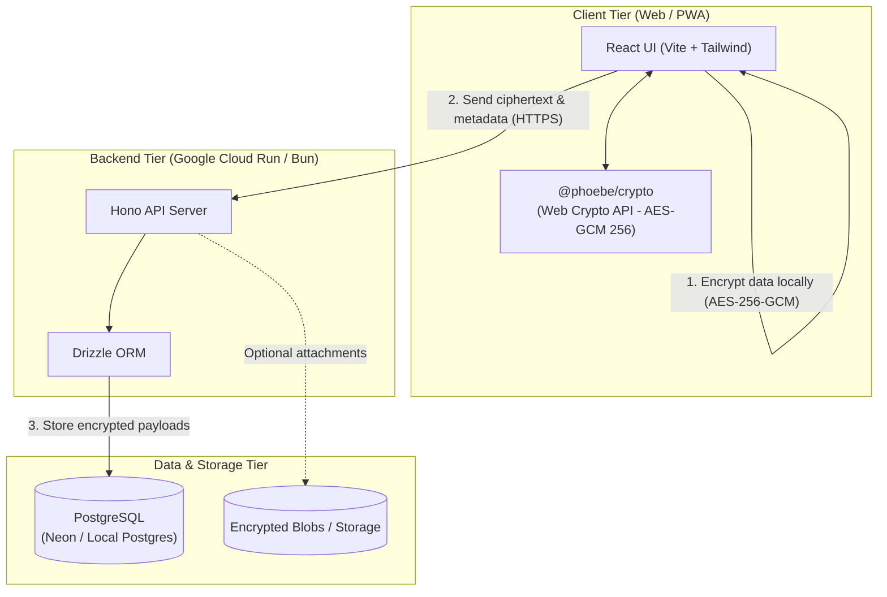

# Phoebe

> Zero-knowledge encrypted family medical records vault and command system.

## Project Abstract

**Phoebe** is a secure, privacy-first family health records vault designed with zero-knowledge architecture and end-to-end client-side encryption (E2EE). Sensitive health data, medical notes, and attachments are encrypted directly on the client using AES-GCM 256-bit cryptography (via the standard Web Crypto API) before transmission. 

The backend API and database only store ciphertext payloads and necessary metadata—encryption keys are generated and held exclusively on client devices, ensuring that neither the server, database, nor cloud providers can access or decrypt sensitive family medical history.

---

## Architecture

Phoebe is structured as a modern monorepo separating client interfaces, API services, shared cryptographic logic, and cloud infrastructure:

- **Frontend Client (`client/`)**: Modern web application built with React, Vite, and Tailwind CSS. Handles client-side key generation, encryption/decryption workflows, and user interface.
- **Backend API (`server/`)**: Fast, lightweight API service built on the Hono framework running on the Bun JavaScript runtime. Manages metadata, authentication, and encrypted record persistence.
- **Shared Crypto Package (`packages/crypto/`)**: Zero-dependency cryptographic library implementing AES-GCM 256-bit encryption, key generation, export, and import on top of the standard Web Crypto API.
- **Database**: PostgreSQL managed with Drizzle ORM for schema definitions and migrations.
- **Infrastructure (`infra/`)**: Infrastructure as Code (IaC) powered by Pulumi, targeting Google Cloud Run and Neon Serverless Postgres.

### Component Diagram



---

## Repository Structure

```text
phoebe/
├── client/              # React (Vite) frontend application
├── server/              # Hono + Bun backend API server
├── packages/
│   └── crypto/          # Shared Web Crypto encryption/decryption package
├── infra/               # Pulumi Infrastructure-as-Code definitions
├── podman-compose.yml   # Local multi-container orchestrator configuration
├── package.json         # Monorepo workspace configuration
└── AGENT.md             # Developer and agent operating guidelines
```

---

## Build and Run

### Prerequisites

- [Bun](https://bun.sh/) (v1.1+)
- [Podman](https://podman.io/) and `podman-compose` (for containerized workflows)

### 1. Local Development (Native)

Install dependencies across all workspace packages:

```bash
bun install
```

Run both frontend and backend concurrently in development mode:

```bash
bun run dev
```

Or run services individually:

```bash
# Frontend (http://localhost:5173)
bun run dev:client

# Backend (http://localhost:3000)
bun run dev:server
```

### 2. Containerized Local Development (Podman Compose)

To start the full stack including PostgreSQL, backend server, and client container:

```bash
podman-compose up --build
```

- **Client**: `http://localhost:5173`
- **Server API**: `http://localhost:3000`
- **PostgreSQL**: `localhost:5432`

### 3. Testing and Quality Checks

Run the test suite across workspaces:

```bash
# Run all unit and integration tests
bun test

# Run type checks and linters
bun run lint
```

### 4. Production Build

Compile TypeScript and build production assets for all workspace packages:

```bash
bun run build
```

---

## License

This project is licensed under the [MIT License](https://opensource.org/licenses/MIT).
